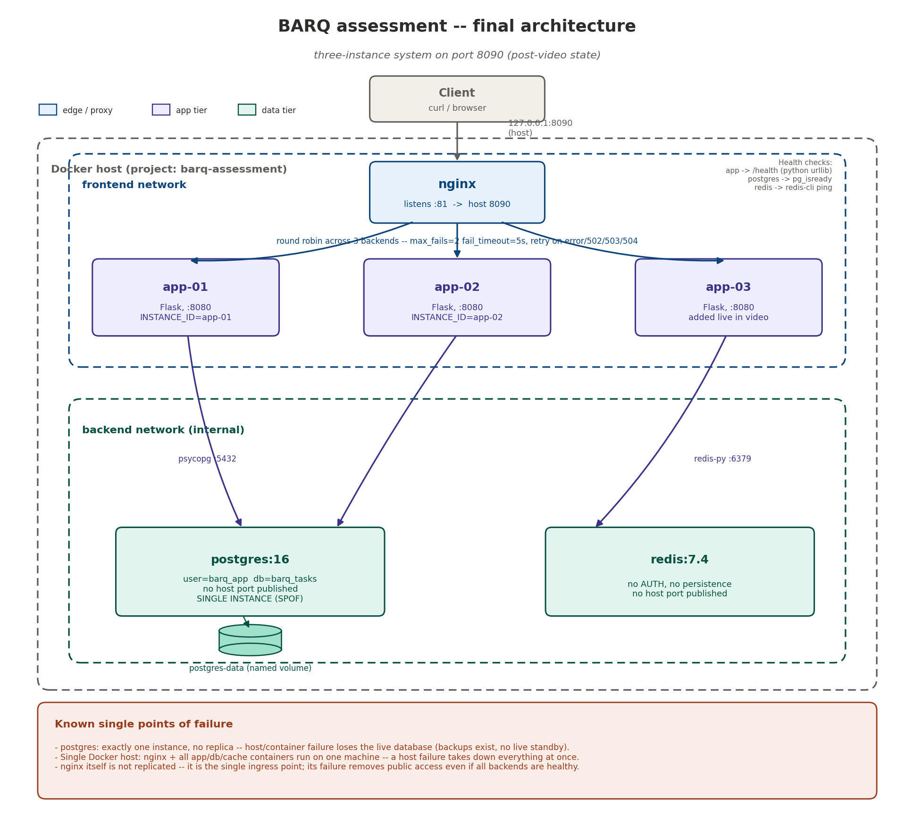

# Architecture

The diagram above shows the final system state (post-video): a client hits
nginx on host port `8090`, which load-balances round-robin across three Flask
instances (`app-01`, `app-02`, `app-03`) on the `frontend` network. Each app
instance reaches PostgreSQL and Redis over the `frontend`+`backend` networks;
`backend` is `internal: true`, so postgres/redis have no route to the host
and nginx itself cannot reach them directly (only the app tier can). PostgreSQL
data is kept in a named volume (`postgres-data`), so it survives container
recreation; Redis has no persistence by design (see `decisions.md`).

Known single points of failure (also called out directly in the diagram):
a single PostgreSQL instance with no replica, a single Docker host running
every container, and an unreplicated nginx as the sole ingress point. See
`security_review.md` for the full risk writeup and production follow-ups.

## Health checks

- app-01 / app-02: `GET /health` via a Python `urllib` one-liner (no extra
  package needed — Python is already the runtime).
- postgres: `pg_isready -U barq_app -d barq_tasks`
- redis: `redis-cli ping`
- nginx: no `HEALTHCHECK` defined — its own reachability (via the client's
  request reaching `/health`/`/ready` through it) is the practical proxy for
  "is nginx working".
